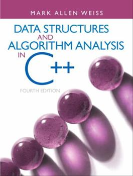

#  Code Examples for Data Structures

Textbook: Data Structures and Algorithm Analysis in C++ (Fourth Edition), by Mark Allen Weiss

Source Code by Mark Allen Weiss can be found [here.](https://users.cs.fiu.edu/~weiss/dsaa_c++4/code/)

Course material and assignments for CS 2341 can be found on [Canvas](https://www.smu.edu/OIT/Services/Canvas/).

## Required Tools

* Install [Visual Studio Code](https://code.visualstudio.com/)
* On Windows you will need to [install WSL](https://code.visualstudio.com/docs/cpp/config-wsl) ([here is a video](https://www.youtube.com/watch?v=NY5izJWXi0U))
* Install [Extensions for C++ and CMake](https://code.visualstudio.com/docs/languages/cpp)
* Install [git](https://git-scm.com/)

## Content

Here are [HOWTOs](Chapter1_Programming/HOWTOs.md) for running, testing, and debugging the code examples.

| Chapter | Slides | Code |
| :-------| :----: | :--: |
| 1: Programming | - | [code](Chapter1_Programming)  |
| 2. Algorithm Analysis | [slides](https://github.com/mhahsler/CS2341/blob/main/slides/Chapter2_Algorithm_Analysis.pdf) | [code](Chapter2_Algorithm_Analysis) |
| 3. Lists, Stacks, and Queues | - | [code](Chapter3_Lists_etc) |
| 4. Trees | - | [code](Chapter4_Trees) |
| 5. Hahsing | - | - |
| 6. Heaps | - | - |
| 9. Graphs | - | - |

## License

All code and documents in this repository are provided under [Creative Commons Attribution-ShareAlike 4.0 International (CC BY-SA 4.0) License.](https://creativecommons.org/licenses/by-sa/4.0/)
